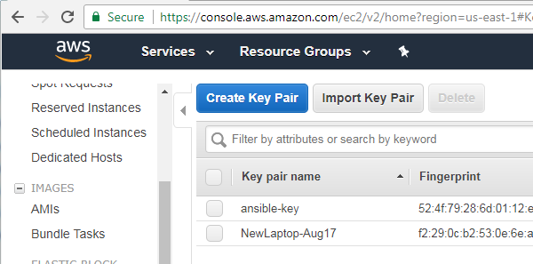

# Ansible Lab 1

## Introduction
Welcome! This lab is intended to demonstrate the use of an automation platform (Ansible) with Check Point Management and Gateway components.

In this lab, we will establish an Ansible setup which will connect to AWS and deploy one Management server and two Gateways.

## Requirements
  - Debian or Ubuntu ISO image
    - http://releases.ubuntu.com/16.04/ubuntu-16.04.3-server-amd64.iso
  - VMWare Workstation

## Installation

  1. Create a new VMWare Virtual Machine

  - Guest Operating System: Linux
  - Version: Ubuntu
  - Maximum Disk Size: 10GB
  - Feel free to create a user account named whatever you would like, with any password you would like.

  2. Boot the Virtual Machine and log in as the user you created during installation

  3. Type ``sudo su -`` to get a root prompt (if your user account is not a superuser)

  4. Install the git package

  ```apt-get install git```

  5. Clone the git repository for Lab 1
  ```
    mkdir /etc/ansible
    cd /etc
    git clone -b lab1.0 https://github.com/ngardiner/ansible_demo.git ansible
  ```

  6. Run the setup script to install all of the necessary packages and prerequisites

  ``` /etc/ansible/setup.sh ```

  7. Log into AWS (https://aws.amazon.com)

  8. Select EC2 > Key Pairs and select Create Key Pair. Name it ansible-key.

  

  - Download and save the key file locally on your PC, and upload it to your Ansible virtual machine
  - Place the file in ``/etc/ansible/keys/ansible-key.ssh``

  9. In the AWS console, select IAM (Identity and Access Management) Console.

  - Select the Users tab
  - Select Add User
  - Enter the username ```admin``` and select Programmatic access type. Click Next.

  

  - Select the attach existing policies directly option
  - Select the AdministratorAccess policy. Click Next.

  
